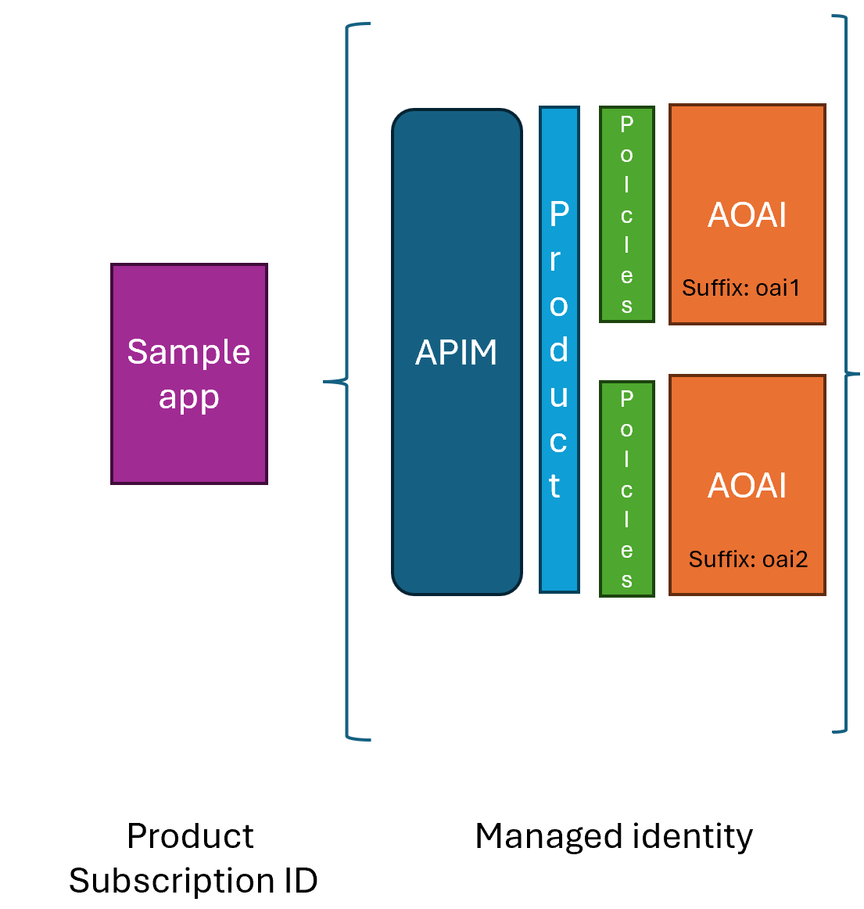

# Documentation

This is the little longer explanation of the sample app and the architecture.

## Architecture



The architecture is set up in the following way:

- **Sample app**
    - **Frontend** The frontend is a simple HTML page that makes requests to the backend.
    - **The backend** is a Node.js app that serves the frontend and makes requests to the Azure Open AI instance.
- **Azure Open AI**, The Azure Open AI instance is an instance of the Azure Open AI API that is used to generate responses to the user's input.
- **The Azure API Management instance** is used to manage the Azure Open AI instances (2 of them) and expose it to the frontend.
- **Policies** are applied to the API to manage the load between the two Azure Open AI instances.
- **Managed identity** is used to authenticate the Azure API Management instance to the Azure Open AI instances.
- **Product and subscriptions**. When you create a product on the Azure API Management instance, you do so to group APIs. You can then create subscriptions to the product to manage access to the APIs.

## Azure API Management

Once you start having many APIs, you need a way to manage them. This is where Azure API Management comes in. Azure API Management (APIM) is a service that helps you publish APIs to external and internal customers. It provides the tools to manage the APIs, monitor them, and secure them.

### Making a request

A typical APIM URL (assuming it has Azure Open AI APIs set up) looks like this:

```http
https://<apim-name>.azure-api.net/<your-api-suffix>/deployments/${deploymentId}/completions?api-version=${apiVersion}
```

An example HTTP URL could then look like so:

```http
https://my-apim.azure-api.net/openai/deployments/gpt-35-turbo/completions?api-version=2020-05-03
```

To make the actual request, you need to make a POST request to the above URL with the following body:

```json
{
    "prompt": "Once upon a time",
    "max_tokens": 50
}
```

and the following headers:

```http
Content-Type: application/json
Ocp-Apim-Subscription-Key: <Your Subscription Key>
```

## Bicep

This section describes the Bicep file that are used to deploy the cloud resources, in case you're interested in what gets deployed.

The cloud resources are described using Bicep, Bicep is a Domain Specific Language (DSL) for deploying Azure resources declaratively. 

- Service, the service is the root resource for the APIM instance and looks like so:

    ```bicep
    resource apimService 'Microsoft.ApiManagement/service@2020-06-01-preview' = {
      name: apimServiceName
      location: location
      sku: {
        name: 'Consumption'
        capacity: 0
      }
      properties: {
        publisherEmail: publisherEmail
        publisherName: publisherName
      }
      identity: {
        type: 'SystemAssigned'
      }
      dependsOn: [
        cognitiveServicesAccount
      ]
    }
    ```

    Here, we see that the resource is called `apimService` and it needs the following fields set:

    - **name**, this is the name of the APIM instance.
    - **location**, this is the location of the resource group.
    - **sku**, note how the name is `Consumption` and the capacity is `0`, this is the pricing tier for the APIM instance.
    - **properties**, this is the publisher email and name.
    - **identity**, note how `type` is `SystemAssigned` this creates a managed identity for the APIM instance that we can refer to later when we connect APIM to the Azure Open AI instance.
    - **dependsOn**, this is an array of resources that this resource depends on, in this case, the cognitive services account that needs to be created before the APIM resource.


- API, this is the resource that represents the API/s in the APIM instance and looks like so:

    ```bicep
    resource api 'Microsoft.ApiManagement/service/apis@2020-06-01-preview' = {
      parent: apimService
      name: apiName
      properties: {
        displayName: apiName
        path: apiPath
        protocols: [
          'https'
        ]
        serviceUrl: cognitiveServicesAccount.properties.endpoint
      }
    }
    ```

    The following fields need to be set:

    - **parent**, this is the parent resource, in this case, the APIM instance.
    - **name**, this is the name of the API.
    - **properties**, this is an object that contains the following fields:
        - **displayName**, this is the display name of the API.
        - **path**, this is the path to the API.
        - **protocols**, this is an array of protocols that the API supports.
        - **serviceUrl**, this is the endpoint of the Azure Open AI instance that the API will point to.

    
- Operation, operations can be defined on an API to represent GET, PUT, POST etc. To define an operation you would type the following Bicep:

    ```bicep
    resource operation 'Microsoft.ApiManagement/service/apis/operations@2020-06-01-preview' = {
      parent: api
      name: operationName
      properties: {
        displayName: operationDisplayName
        method: 'POST'
        urlTemplate: '${cognitiveServicesAccount.properties.endpoint}${operationUrlTemplate}'
        responses: []
      }
    }
    ```

    The following fields are defined:
    - **parent**, this is the parent resource, in this case, the API.
    - **name**, this is the name of the operation.
    - **properties**, this is an object that contains the following fields:
        - **displayName**, this is the display name of the operation.
        - **method**, this is the HTTP method of the operation.
        - **urlTemplate**, this is the URL template of the operation.
        - **responses**, this is an array of responses that the operation can return.

- Product, helps expose what APIs are available to developers and looks like so:

    ```bicep
    resource product 'Microsoft.ApiManagement/service/products@2020-06-01-preview' = {
      parent: apimService
      name: productName
      properties: {
        displayName: productName
        subscriptionsLimit: 100
        approvalRequired: false
        subscriptions: [
          {
            displayName: 'Subscription',
            scope: '/apis/${apiName}',
            approvalRequired: false
          }
        ]
      }
    }
    ```

    The following fields are defined:
    - **parent**, this is the parent resource, in this case, the APIM instance.
    - **name**, this is the name of the product.
    - **properties**, this is an object that contains the following fields:
        - **displayName**, this is the display name of the product.
        - **subscriptionsLimit**, this is the limit of subscriptions that can be created for the product.
        - **approvalRequired**, this is a boolean that determines if approval is required for subscriptions.
        - **subscriptions**, this is an array of subscriptions that can be created for the product.
        
- Subscription, this is a subscription to a product and looks like so:

    ```bicep
    resource subscription 'Microsoft.ApiManagement/service/products/subscriptions@2020-06-01-preview' = {
      parent: product
      name: '${apimServiceName}/${productName}/${subscriptionName}'
      properties: {
        scope: '/users/${userId}'
        displayName: subscriptionName
        state: 'active'
      }
    }
    ```

- Policy, TODO

**Authentication**

We've already hinted in places how authentication works in APIM, but let's dive deeper into it. 

- Enable managed identity by setting the `identity` property to `SystemAssigned` in 

    - the APIM instance
    - the Azure Open AI instance
- Create role assignment on the Azure Open AI instance to allow the APIM instance to access the Azure Open AI instance. This involves Bicep looking like so:

    ```bicep
    resource roleAssignment 'Microsoft.Authorization/roleAssignments@2020-04-01-preview' = {
      name: guid(apimService.id, roleDefinitionId)
      scope: cognitiveServicesAccount
      properties: {
        roleDefinitionId: roleDefinitionId
        principalType: 'ServicePrincipal'
        principalId: apimService.identity.principalId
      }
    }
    ```

    - **principalId**, this is the principal ID of the managed identity of the APIM instance.
    - **scope**, this is the scope of the role assignment, in this case, the Azure Open AI instance.
    - **roleDefinitionId**, this is the role definition ID of the role you want to assign to the APIM instance. It should be a GUID that represents the role you want to assign which in our case is a Cognitive Services User role.

- Add Auth policy to the API in APIM, this means we create a policy that's applied on inbound traffic to the API or a specific operation on the API and looks something like so:

    ```xml
    <authentication-managed-identity resource="https://cognitiveservices.azure.com" output-token-variable-name="managed-id-access-token" ignore-error="false" /> 
    <set-header name="Authorization" exists-action="override"> 
        <value>@("Bearer " + (string)context.Variables["managed-id-access-token"])</value> 
    </set-header> 
    ```

- Create a product and expose the API/s. TODO
- Create a subscription on said product TODO
