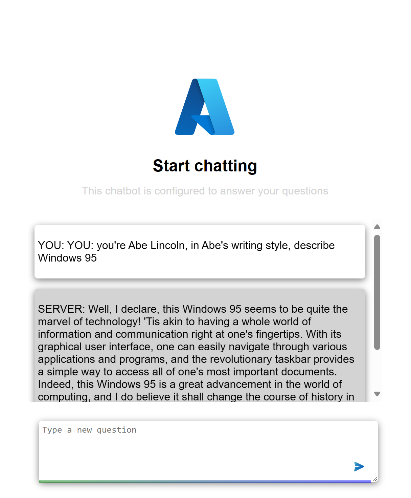

# Azure APIM Azure Open AI sample

This is a sample project that demonstrates how to use Azure API Management and Azure Open AI to create a simple chatbot.

## -0- Prerequisites

- [Azure CLI](https://docs.microsoft.com/en-us/cli/azure/install-azure-cli)
- [Node.js](https://nodejs.org/en/download/)

## -1- Deploying the project

To deploy the project run the following commands:

```bash
az login
az account set --subscription <Your Subscription ID>
az group create -n <Your Resource Group Name> -l <Your Resource Group Location>
az deployment group create -f main.bicep -g <Your Resource Group Name>
```

This should deploy the following cloud resources:

- Azure API Management
    - 1x APIM service
    - 1x APIM API
    - 3x backends
        - 1x backend, for the Azure Open AI instance
        - 1x backends, for the Azure Open AI instance
        - 1x backend, for the load balancer
    - Product, exposing the Azure Open AI APIs.
        - Subscription
    - Managed identity between APIM and Azure Open AI instances
    - Policies including:
        - Rate limiting
        - Token metrics
        - Token limit
        - Circuit breaker
- 2x Azure Open AI

## -2- Run the project locally

To run requests against the APIM endpoint, you need to set some environment variables namely:

- `SUBSCRIPTION_KEY`, this is the subscription key for the APIM instance. You can find this is the Azure portal under the APIM instance, check for subscriptions.
- `DEPLOYMENT_ID`, 
    - NOTE: this is hardcoded in `main.bicep` as "conversation-model".
- `API_VERSION`, 
    - NOTE: this is hardcoded in `main.bicep` as "2024-03-01-preview".
- `APIM_ENDPOINT`, this is the endpoint for the APIM instance, typically `https://<your-apim-name>.azure-api.net`. This is the endpoint you use to access the APIM instance.
- `API_SUFFIX`, this is the suffix for the API, typically `openai` or what you've chosen to name it when configuring the Azure Open AI instance in APIM. The URL to access the APIM endpoint should look like `https://<your-apim-name>.azure-api.net/<your-api-suffix>`.   
    - NOTE: hardcoded in `main.bicep` as "myApi/openai".

To run this locally, you need to provide the below environment variables, you can do this by creating a `.env` file in the root of the project and setting the values there.

- Set the environment variables in the `.env` file, it should look like this:

    ```bash
    SUBSCRIPTION_KEY="<Your Subscription Key>"
    DEPLOYMENT_ID="<Your Deployment ID>"
    API_VERSION="<Your API Version>"
    APIM_ENDPOINT="<Your APIM Endpoint>"
    API_SUFFIX="<Your API Suffix>"
    ```

    Once you have set the environment variables, you can run the app by running the below commands:

    ```bash
    npm install
    npm start
    ```

    This will start the app on `http://localhost:3000` and the API is available at `http:localhost:5000`.

## What's in this repo

|What  |Description  | Link |
|---------|---------|--|
|Frontend     | a frontend consisting of a `index.html` and `app.js` | [Link](./src/web/)        |
|Backend     | A backend written in Node.js and Express framework | [Link](./src/api/)        |
|Bicep     | Bicep files containing the needed information to deploy resources and configure them as needed        | [Link](./main.bicep) |

## Demo



## Documentation

The documentation for this project is available in the [DOC.md](./DOC.md) file.