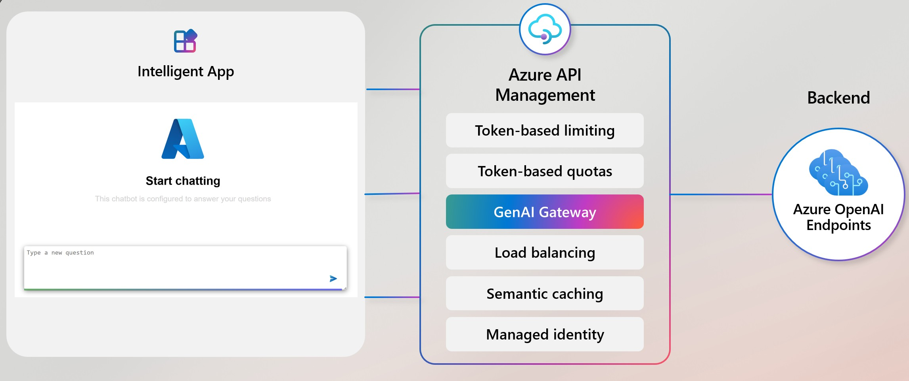

<div align="center">

# Manage your Azure OpenAI APIs with Azure API Management

[](https://codespaces.new/Azure-Samples/genai-gateway-apim?hide_repo_select=true&ref=main&quickstart=true)
[](LICENSE)

This sample shows how to [manage Generative AI APIs at scale using Azure API Management and Azure OpenAI Service](https://learn.microsoft.com/training/modules/api-management/?WT.mc_id=javascript-155817-juliamuiruri) for a simple chatbot.

(Like and fork this sample to receive lastest changes and updates)

[](#features)
[](#architecture)
[](#getting-started)
[](#guidance)
[](#resources)
[](#troubleshooting)
[](#contributing)
[](#trademarks)
[](LICENSE)
[](https://github.com/Azure-Samples/genai-gateway-apim/stargazers)

  

</div>

## Features

This sample demonstrates how to build and manage a scalable AI application using Azure API Management (APIM) and Azure OpenAI Service. The sample includes a chat interface that sends messages through APIM to load-balanced Azure OpenAI endpoints, showcasing enterprise-grade API management for AI workloads.

## Architecture



The architecture is set up in the following way:

- **Sample app**
  - **Frontend**: Two files, `index.html` and `app.js`, that make requests to the backend.
  - **Backend**: A Node.js Express app that serves the frontend and makes requests to the Azure Open AI instance.
- **Azure OpenAI Service**:  Two instances of Azure OpenAI models, one primary endpoint and one secondary/ failover endpoint.
- **Azure API Management**: Manages the Azure OpenAI instances and exposes them to the frontend.
- **Managed identity**: Used to authenticate the Azure API Management instance to the Azure Open AI instances.

The documentation for this project is available in the [DOC.md](./DOC.md) file.

## Getting Started

You have a few options for getting started with this template. The quickest way to get started is [GitHub Codespaces](#using-github-codespaces), since it will setup all the tools for you, but you can also [set it up locally](#running-locally). You can also use a [VS Code dev container](#using-vs-code-dev-container)

### Using GitHub Codespaces

You can run this template virtually by using GitHub Codespaces. The button will open a web-based VS Code instance in your browser:

1. Open the template (this may take several minutes to build the container)

    [](https://codespaces.new/Azure-Samples/genai-gateway-apim?hide_repo_select=true&ref&quickstart=true)

1. Open the terminal
1. Run `azd auth login` to sign in to Azure.
1. Deploy resources with `azd up` (this may take several minutes to deploy the resources).

    You'll be asked to provide:
    - An _environment name_, which will be use as a prefix for naming resources in your deployment
    - An _Azure subscription_
    - An _Azure location_
    - An `apimLocation`

    > [!NOTE]
> Enter a value of `koreacentral`. The new API Management SKUv2 tier is used in this demo which is supported in the [following regions](https://learn.microsoft.com/azure/api-management/v2-service-tiers-overview?WT.mc_id=javascript-155817-juliamuiruri#supported-regions).

1. Start the app.

    ```bash
    cd src && npm start
    ```

### Using VS Code Dev Container

A related option is VS Code Dev Containers, which will open the project in your local VS Code using the Dev Containers extension

You need to install [VS Code](https://code.visualstudio.com/?WT.mc_id=javascript-155817-juliamuiruri), [Dev Containers extension](https://marketplace.visualstudio.com/items?itemName=ms-vscode-remote.remote-containers&WT.mc_id=javascript-155817-juliamuiruri) and [Docker Desktop](https://www.docker.com/products/docker-desktop/)

1. Start Docker Desktop
1. Open the project (this may take several minutes to build the container)

    [](https://vscode.dev/redirect?url=vscode://ms-vscode-remote.remote-containers/cloneInVolume?url=https://github.com/Azure-Samples/genai-gateway-apim)

1. Open the terminal
1. Run `azd auth login` to sign in to Azure.
1. Deploy resources with `azd up` (this may take several minutes to deploy the resources).

    You'll be asked to provide:
    - An _environment name_, which will be use as a prefix for naming resources in your deployment
    - An _Azure subscription_
    - An _Azure location_
    - An `apimLocation`

    > [!NOTE]
> Enter a value of `koreacentral`. The new API Management SKUv2 tier is used in this demo which is supported in the [following regions](https://learn.microsoft.com/azure/api-management/v2-service-tiers-overview?WT.mc_id=javascript-155817-juliamuiruri#supported-regions).

1. Install dependencies and start the app.

    ```bash
    cd src
    npm install
    npm start
    ```
This will start the app on http://localhost:3000 and the API is available at http://localhost:1337

### Running Locally

#### Prerequisites

- [VS Code](https://code.visualstudio.com/?WT.mc_id=javascript-155817-juliamuiruri)
- [Azure Developer CLI (azd)](https://learn.microsoft.com/azure/developer/azure-developer-cli/install-azd?WT.mc_id=javascript-155817-juliamuiruri)
- [Node.js](https://nodejs.org/)

Then you can get the project code:

1. [**Fork**](https://github.com/Azure-Samples/genai-gateway-apim/fork) the project to create your own copy of this repository.
2. On your forked repository, select the **Code** button, then the **Local** tab, and copy the URL of your forked repository.
3. Open a terminal and run this command to clone the repo: <code> git clone &lt;your-repo-url&gt; </code>
4. Install dependencies and start the app.

    ```bash
    cd src
    npm install
    npm start
    ```

This will start the app on http://localhost:3000 and the API is available at http://localhost:1337

## Guidance

### Region Availability and Quota

- Azure OpenAI Service is available in [specific regions](https://learn.microsoft.com/azure/ai-services/openai/quotas-limits?WT.mc_id=javascript-155817-juliamuiruri#regional-quota-limits)
- Request [quota](https://learn.microsoft.com/azure/ai-services/openai/quotas-limits?WT.mc_id=javascript-155817-juliamuiruri#quotas-and-limits-reference) increases if needed through Azure Portal
- API Management service tier v2 is currently available in [limited regions](https://learn.microsoft.com/azure/api-management/api-management-region-availability?WT.mc_id=javascript-155817-juliamuiruri)
  - We recommend using `koreacentral` for this sample

### Cost Considerations

- Azure OpenAI Service: Pay per token usage
- API Management: Cost varies by tier (this sample uses StandardV2)
- Consider enabling budgets and cost alerts

### Security

- Use managed identities for service-to-service authentication
- Enable APIM policies for rate limiting and circuit breaking
- Follow least-privilege access principles
- Monitor API usage and implement alerting.
  - You can use the [Azure pricing calculator](https://azure.microsoft.com/pricing/calculator/?WT.mc_id=javascript-155817-juliamuiruri) to get an estimate.

> [!WARNING]
> To avoid unnecessary costs, remember to take down your app if it's no longer in use, either by deleting the resource group in the Portal or running `azd down --purge`.

### Inspect environment variables

After running the `azd up` command, an environment file will be generated for you at `src/.env`. Here's some of the key information added to the `.env` file.

```bash
APIM_ENDPOINT="<Your APIM Endpoint>"
API_SUFFIX="<Your API Suffix>"
API_VERSION="<Your API Version>"
DEPLOYMENT_ID="<Your Deployment Name>"
SUBSCRIPTION_KEY="<Your Subscription Key>"
```

**Finding values using the Azure portal:**

If you'd like to find the values in the `.env` yourself, follow these steps:

|Value  |Instruction  |
|---------|---------|
| APIM_ENDPOINT | Navigate to `portal.azure.com` -> Select `rg` -> Select `APIM instance` -> Go to `Overview` -> Copy `Gateway URL` |
| API_SUFFIX | Navigate to `portal.azure.com` -> Select `rg` -> Select `APIM instance` -> Navigate to` APIs/APIs` -> open `myAPI` -> Go to `Settings` -> Copy `API URL suffix` |
| API_VERSION | Open https://learn.microsoft.com/azure/ai-services/openai/reference#completions, Copy most recent Supported versions = `2024-02-01` |
| DEPLOYMENT_ID | Navigate to `portal.azure.com` -> Select `rg` -> Select 1st OpenAI instance -> Go to `Resource Management/Mode deployments` -> Click on `Manage Deployments` to open Azure AI Studio -> Copy `Deployment name` |
|SUBSCRIPTION_KEY     | Navigate to `portal.azure.com` -> Select `rg` -> select `APIM instance` -> Go to `APIs/Subscriptions` -> Click `show/hide keys` on first row (Built-in all-access) -> copy `Primary key`        |

## Deprovision the resources

Once you're done, you can remove all deployed resources using `azd down --purge`

> [!NOTE]
> Some resources on Azure are only soft deleted for performance reasons and can be retrieved. By using `--purge` resources are hard deleted and cannot be retrieved.

## Resources

- [Manage your Gen AI APIs with Azure API Management Module](https://learn.microsoft.com/training/modules/api-management?WT.mc_id=javascript-155817-juliamuiruri)
- [Azure API Management Documentation](https://learn.microsoft.com/azure/api-management/?WT.mc_id=javascript-155817-juliamuiruri)
- [Azure OpenAI Service Documentation](https://learn.microsoft.com/azure/ai-services/openai/?WT.mc_id=javascript-155817-juliamuiruri)

## Troubleshooting

- If deployment fails, check:
  - Regional availability of services
  - Quota limits
  - Required permissions

- For application issues:
  - Review APIM diagnostic logs
  - Check Azure Monitor metrics
  - Validate environment variables

If you can't find a solution to your problem, please [open an issue](https://github.com/Azure-Samples/genai-gateway-apim/issues) in this repository.

## Contributing

This project welcomes contributions and suggestions. Most contributions require you to agree to a Contributor License Agreement (CLA) declaring that you have the right to, and actually do, grant us the rights to use your contribution. For details, visit https://cla.opensource.microsoft.com.

This project has adopted the [Microsoft Open Source Code of Conduct](https://opensource.microsoft.com/codeofconduct/).
For more information see the [Code of Conduct FAQ](https://opensource.microsoft.com/codeofconduct/faq/) or
contact [opencode@microsoft.com](mailto:opencode@microsoft.com) with any additional questions or comments.

## Trademarks

This project may contain trademarks or logos for projects, products, or services. Authorized use of Microsoft trademarks or logos is subject to and must follow
[Microsoft's Trademark & Brand Guidelines](https://www.microsoft.com/legal/intellectualproperty/trademarks/usage/general).

Use of Microsoft trademarks or logos in modified versions of this project must not cause confusion or imply Microsoft sponsorship.
Any use of third-party trademarks or logos are subject to those third-party's policies.
